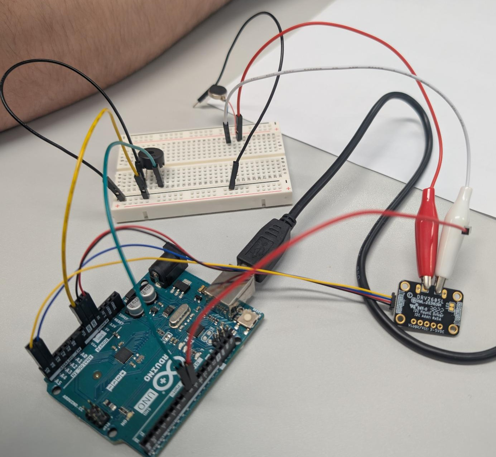
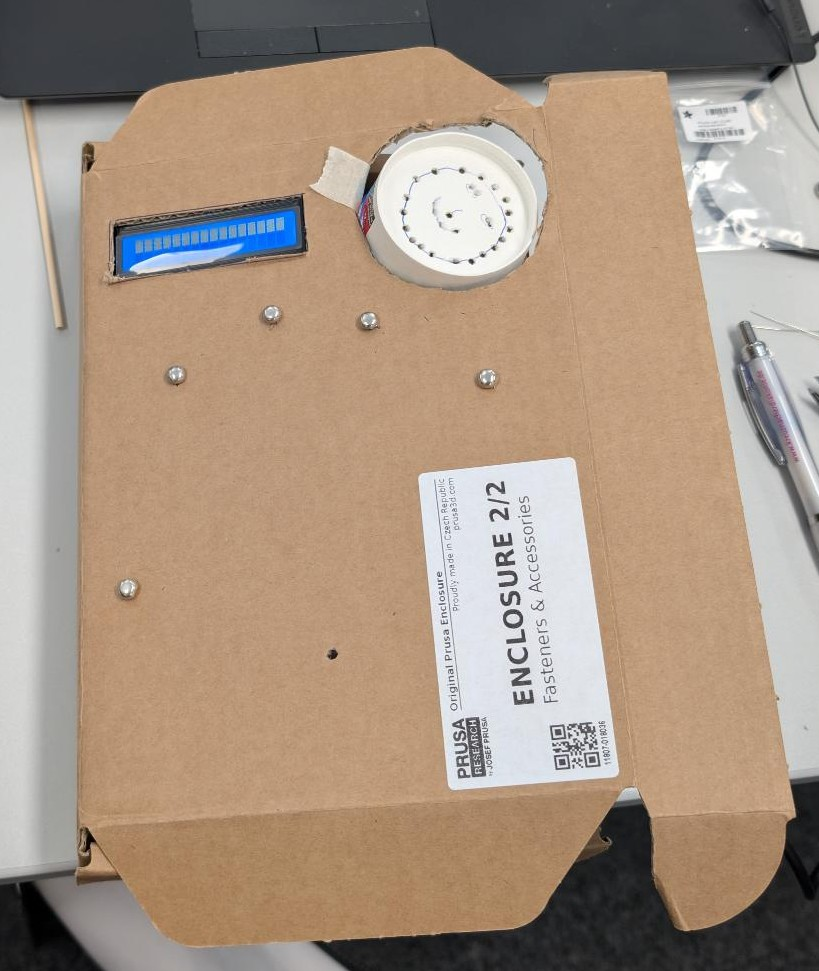
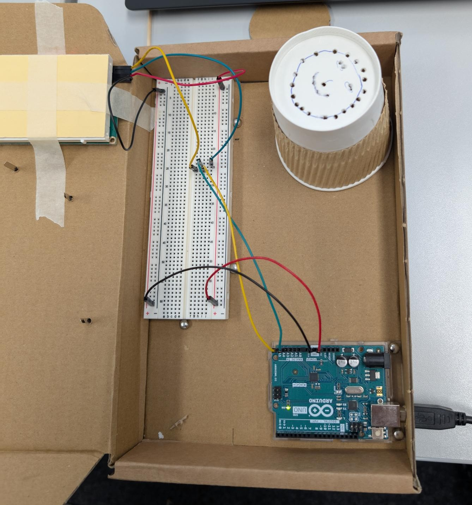
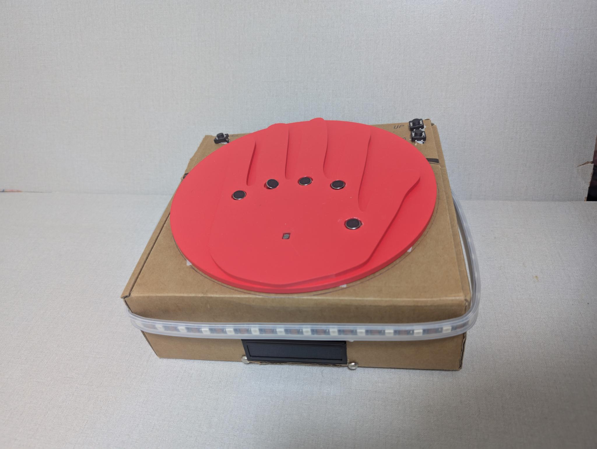
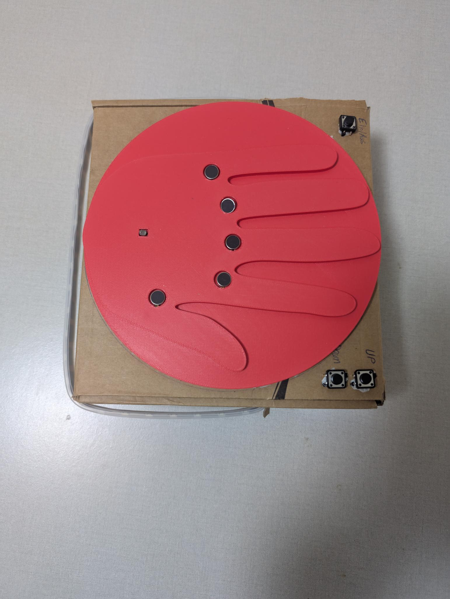
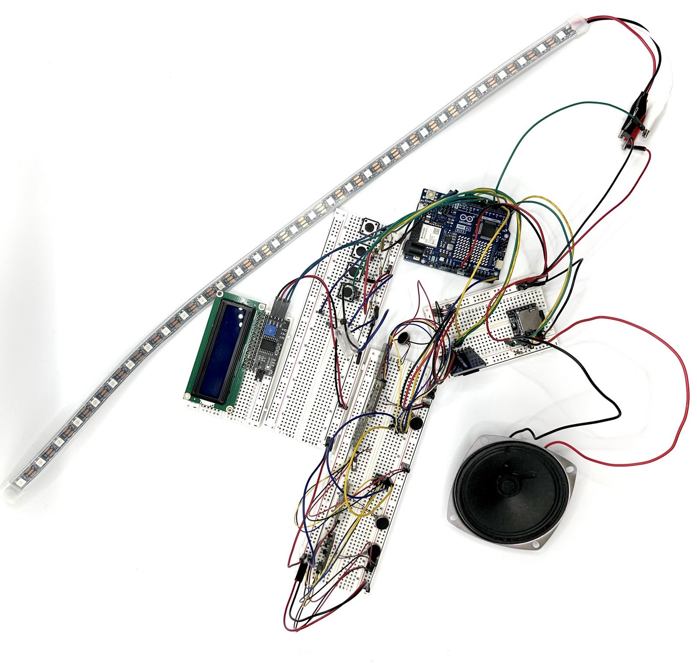

# 🎵 „Fühle die Musik“ – Projektdokumentation

> **Kurs / Semester:** Prototyping Interactive Objects – SoSe 2025  
> **Projektname:** Fühle die Musik  
> **Team:** Omar Assad Salem und Tarek Wais   
> **Version:** 1.0  
> **Hinweis:** Diese Dokumentation ist nach den Rubriken „Projekt-Doku / Demo-Präsentation / Technische Tiefe“ strukturiert.

---

## 1.0 Executive Summary (Kurzüberblick)
- Ziel: Musik **hörbar**, **sichtbar** (NeoPixel) und **spürbar** (Vibration) machen.
- Kern: Arduino UNO R4 WiFi + DFPlayer Mini (MP3), DRV2605L (Haptik), LCD-Display (I²C), LDR/Taster als Trigger.
- Stand: Hardware aufgebaut auf Breadboards, Basis-Software modular lauffähig.


### 1.1 Funktionsumfang
- **Zwei Startarten (Modi):**
  - **LDR‑Trigger:** Hand über LDR ⇒ System startet eine vordefinierte Sequenz.
  - **Menü‑Modus (optional):** LCD 16×2 zeigt Titel aus `songs.txt`; Tasten **hoch/runter** wechseln den Song; Start erfolgt sofort (OK optional).
- **Audio (optional):** DFPlayer Mini spielt **`NNN.mp3`** (z. B. `001.mp3`) von microSD; **`songs.txt`** liefert **ID,Titel** für die Anzeige.
- **Licht‑Mapping:** NeoPixel‑LEDs folgen CSV‑Dateien **`NNN_light.csv`** mit Zeitstempeln und RGB‑Werten (*`time_ms,r,g,b`*).
- **Vibrations‑Mapping:** DRV2605L spielt CSV‑basierte Haptikmuster **`NNN_vibe.csv`** (*`time_ms,pattern`*).
- **Synchronisation:** `resetAllEffects()` setzt die Zeitbasis zurück, damit Licht & Vibration **gleichzeitig** starten.
- **Status/Bedienung (optional):** LCD zeigt „Now playing …“ + Songtitel; Taster **D8/D5** (hoch/runter), **D7** (OK, optional).
- **Debug & Robustheit:** Serielle Logausgabe (115200) für Fehlersuche; I²C‑Adresse des LCDs per Scanner ermittelbar; Hinweise zu 5 V‑Versorgung & gemeinsamem GND.

### 1.2 Funktionsumfang

Das Projekt wurde schrittweise entwickelt. Am Ende entstand ein System, das Musik hörbar, sichtbar und fühlbar macht.  
Um den Weg dorthin nachzuvollziehen, dokumentieren wir hier die wichtigsten Entwicklungsstufen.

#### Entwicklungsstufe 1: Erster Testaufbau



Auf diesem Foto ist der **erste Versuchsaufbau** zu sehen:
- Ein **Arduino UNO** ist über USB mit dem Laptop verbunden.
- Auf dem **Breadboard** sind ein kleiner **Buzzer** und ein **Steuerelement** angeschlossen.
- Über einfache Kabelverbindungen wurden die Komponenten mit **5 V, GND und einem digitalen Pin** des Arduino verbunden.

👉 Ziel dieses Schritts war es:
- Einen **einfachen Testcode** zu schreiben, der den Buzzer ansteuert.  
- Zu prüfen, ob die Kommunikation zwischen Arduino und Breadboard-Schaltung funktioniert.  
- Die Grundlage für spätere Erweiterungen (z. B. NeoPixel, Vibration, SD-Karte) zu schaffen.

Mit diesem Test war sichergestellt: **Das Grundsystem funktioniert.**  
Im nächsten Schritt wurde es um weitere Module (LDR, DRV2605L, NeoPixel) erweitert, um das Endprodukt „Fühle die Musik“ zu realisieren.


#### Entwicklungsstufe 2: DFPlayer Mini mit Lautsprecher


In der zweiten Stufe wurde der **DFPlayer Mini** in das Projekt integriert.  
Dadurch konnten nun echte **MP3-Dateien** von einer microSD-Karte abgespielt werden.  

- Der **DFPlayer Mini** ist über **Serial1 (Pins D0/D1)** mit dem Arduino verbunden.  
- Ein kleiner **Lautsprecher** ist direkt am DFPlayer angeschlossen (Pins SPK_1 / SPK_2).  
- Die **microSD-Karte** enthält die MP3-Dateien (z. B. `001.mp3`, `002.mp3`), die automatisch erkannt werden.  

👉 Ziel dieses Schritts war es:
- Den **Buzzer durch echte Musik** zu ersetzen.  
- Den **Audio-Teil des Endprodukts** zuverlässig zum Laufen zu bringen.  
- Erste Erfahrungen mit der **Dateiverwaltung auf der SD-Karte** zu sammeln.  

🎥 **Demo-Video:**  
📹 [DFPlayer Mini – kurzes Demo-Video](./dfPlayerEinsatz.mp4)

> Mit diesem Schritt war der Grundstein für die **Musik-Komponente** gelegt.  


#### Entwicklungsstufe 3: Erstes Gehäuse aus Pappe




In dieser Stufe haben wir begonnen, die Elektronik in ein **provisorisches Gehäuse aus Pappe** einzubauen.  
Das Ziel war, ein erstes Gefühl für die **Größe, Platzierung und Bedienbarkeit** des späteren Endprodukts zu bekommen.

- Außen wurde eine **Aussparung für das LCD-Display** geschnitten, damit die Anzeige von außen sichtbar ist.  
- Für den Lautsprecher wurde ein **Lochmuster** gebohrt, damit der Klang nach außen gelangt.  
- Innen wurden **Arduino, Breadboard und Verkabelung** sauber fixiert.  
- Mit Klebeband wurde das Setup stabilisiert, um erste Tests im „Gehäuse-Modus“ durchzuführen.  

👉 Zweck dieses Schritts:
- Erste **Ergonomie-Tests**: Passt das Display an der Stelle? Wie ist die Sichtbarkeit?  
- **Akustik-Test**: Wie klingt der Lautsprecher im Gehäuse?  
- **Platzcheck**: Reicht der Raum für alle Module (SD-Karte, DRV2605L, NeoPixel)?  

> Mit diesem Papp-Gehäuse entstand die erste **greifbare Version des Endprodukts**.  
> Es diente als Vorlage für spätere stabilere Versionen (z. B. 3D-Druck).


---

## 2. DEMO-MEDIEN

Die folgenden Bilder und Medien zeigen das **Endprodukt** von *Fühle die Musik* sowie Detailansichten und ein Demo-Video.  
Sie dienen dazu, dass Nachbauer:innen sofort verstehen, wie das Projekt aussieht und funktioniert.

---

### 2.1 Hero-Foto – fertiger Aufbau




👉 Hier ist das **fertige Endprodukt** zu sehen:
- Das **Pappgehäuse** enthält alle Komponenten.  
- Oben befindet sich eine **rote Handauflage** aus Kunststoff, unter der sich LDR und Sensoren befinden.  
- An den Seiten sind **Bedientaster** eingelassen.  
- Ein **LED-Streifen (NeoPixel)** umläuft das Gehäuse und sorgt für Lichteffekte.  
- Vorne ist das **LCD 16×2 Display** sichtbar, das den aktuellen Song anzeigt.  

Damit wird das Motto des Projekts „Musik hören, sehen und fühlen“ sichtbar umgesetzt.

#### 2.1.1 Gehäuse-Entwicklung
Das Gehäuse sollte ursprünglich **3D-gedruckt** werden.  
Wir haben ein Modell entworfen, aber es konnte **nicht in einem Stück gedruckt werden**, da uns kein **größerer 3D-Drucker** zur Verfügung stand.  

Stattdessen nutzten wir ein **Pappgehäuse** als Ersatz, um:
- die **Platzierung von Komponenten** (LCD, Lautsprecher, Taster, LDR) zu testen,  
- die **Kabeldurchführungen** zu simulieren,  
- und die **Handauflage** auf der Oberseite auszuprobieren.  

👉 Zur besseren Veranschaulichung wird hier ein **GIF der Gehäuseidee** ergänzt:


---

### 2.2 Schaltplan (Breadboard-Aufbau)

👉 Eigentlich sollte hier ein **Schaltplan in Fritzing** ergänzt werden.  
Da dieser noch in Arbeit ist, zeigen wir zunächst den **realen Breadboard-Aufbau** mit allen verbundenen Modulen.  
Damit ist sofort sichtbar, wie die Module verdrahtet wurden.



**Erkennbar sind:**
- Oben: **Arduino UNO R4 WiFi**
- Links: **LCD 16×2 (I²C)** mit blauer Anzeige
- Unten: **Lautsprecher** am DFPlayer Mini
- Rechts: **microSD-Modul**
- Oben & unten: **NeoPixel-Streifen**
- Mehrere **Taster** für Bedienung
- **LDR-Sensor** auf dem Breadboard


---

### 2.3 Demo-Video (15–60 s)

🎥 Das Demo-Video zeigt den Ablauf:  
1. Startzustand → System wartet.  
2. **Hand über LDR** → Musik startet.  
3. **Licht (NeoPixel) und Vibration (DRV2605L)** laufen synchron zur Musik.  
4. **LCD** zeigt den aktuellen Titel.  
5. **Songwechsel** per Tasten (hoch/runter).  


---

## 3. MATERIALS (BOM)

| Pos | Bauteil                              | Anzahl | Zweck                                    | Hinweise |
|----:|--------------------------------------|-------:|------------------------------------------|----------|
| 1   | **Arduino UNO R4 WiFi**              | 1      | Hauptcontroller, steuert alle Module     | 5 V Logik, USB-C |
| 2   | **NeoPixel LED-Streifen (WS2812)**   | 1      | Lichteffekte synchron zur Musik          | z. B. 30 LEDs; DIN → D6 |
| 3   | **Adafruit DRV2605L Haptic Driver**  | 1      | Vibrationsausgabe                        | I²C-Adresse 0x5A |
| 4   | **LDR (Lichtsensor) + 10 kΩ Widerstand** | 1   | Erkennung „Hand drauf = Startsignal“    | Spannungsteiler an A0 |
| 5   | **microSD-SPI-Modul + microSD (FAT32)** | 1   | Speicherung der Mapping-Dateien          | CS → D4; MOSI/MISO/SCK über ICSP |
| 6   | (Optional) **LCD 16×2 I²C Display**  | 1      | Anzeige „Now Playing“ + Songtitel        | Adresse 0x27 oder 0x3F |
| 7   | (Optional) **DFPlayer Mini + Lautsprecher** | 1 | MP3-Wiedergabe (Musik vom DFPlayer)      | UART über Serial1 (D0/D1), eigene SD |
| 8   | **Breadboard**                       | 1      | Steckaufbau ohne Löten                   | — |
| 9   | **Jumper-Kabel (male-male, male-female)** | viele | Verbindungen zwischen Modulen            | — |
| 10  | **USB-C Kabel**                      | 1      | Stromversorgung + Programmierung         | Direkt an PC oder an Batterie |
| 11  | **5 V Netzteil (≥2 A, empfohlen)**   | 1      | Externe Stromversorgung für viele LEDs   | GND mit Arduino verbinden |

> 🔑 **Hinweis:** Bei mehr als ~30 LEDs kann der Strombedarf sehr hoch werden (bis 60 mA pro LED bei Weißlicht). In diesem Fall ist eine externe 5 V-Versorgung nötig.


---

## 4. EQUIPMENT

In diesem Kapitel wird alles aufgeführt, was zusätzlich zu den eigentlichen Bauteilen benötigt wird.  
Das hilft Einsteiger*innen, sich rechtzeitig alles bereitzulegen.

### 4.1 Equipment (Software & Geräte)
- **PC oder Laptop** (Windows, macOS oder Linux)
- **Arduino IDE ≥ Version 2.x** (kostenlos: https://www.arduino.cc/en/software)
- (optional) **3D-Drucker** → für ein eigenes Gehäuse
- (optional) **Lötstation** → falls Kabel/Stecker fest verlötet werden sollen
- (optional) **Fritzing** → zur Erstellung von Schaltplänen

### 4.2 Tools (Werkzeuge)
- **Breadboard** → für den steckbaren Prototyp
- **Multimeter** → zum Messen von Spannung und Strom (Fehlersuche)
- **Schraubendreher** → für Anschlussklemmen
- **Abisolierzange** → zum Vorbereiten von Kabeln
- **Pinzette** → hilfreich bei kleinen Bauteilen
- (optional) **Heißklebepistole** → Fixierung von Kabeln/Modulen im Prototyp

### 4.3 Materials (Hilfsmittel & Verbrauchsmaterial)
- **Jumper-Kabel** (male-male, male-female)
- **USB-C Kabel** (für den Arduino UNO R4 WiFi)
- **Breadboard** (falls nicht schon in BOM berücksichtigt)
- **Klebeband oder Kabelbinder** → für sauberes Kabelmanagement
- (optional) **Gehäusematerial** (Acrylplatten, PLA-Filament für 3D-Drucker)


---

## 5. FABRICATION FILES

Alle Dateien für das Projekt liegen in **einem einzigen Ordner** namens `MusikVibe`.  
Das macht es für Einsteiger besonders einfach: Es gibt nur einen Ordner, den man in der Arduino IDE öffnen muss.

### 5.1 Quellcode (C++/Arduino)
Im Ordner `MusikVibe/` befinden sich folgende Dateien:

MusikVibe/
├─ MusikVibe.ino # Hauptsketch (Einstiegspunkt)
├─ display_menu.cpp # LCD-Menü, Songauswahl, Taster-Logik
├─ display_menu.h
├─ effects_control.cpp # Synchronisation von Licht & Vibration
├─ effects_control.h
├─ ldr_sensor.cpp # LDR-Trigger (Hand über Sensor = Start)
├─ ldr_sensor.h
├─ light_mapping.cpp # Lichteffekte aus CSV-Dateien
├─ light_mapping.h
├─ sound_to_vibe.cpp # Vibrationseffekte aus CSV-Dateien
├─ sound_to_vibe.h


👉 **Hinweis für Anfänger:**  
Die `.ino`-Datei (`MusikVibe.ino`) ist die Hauptdatei. Alle anderen Dateien sind **Module**, die automatisch mitkompiliert werden, wenn sie im gleichen Ordner liegen.  
Man muss also nur den Ordner `MusikVibe` öffnen und kann alles direkt hochladen.

## 5. FABRICATION FILES

Alle Dateien für das Projekt liegen in **einem einzigen Ordner** namens `MusikVibe`.  
Das macht es für Einsteiger besonders einfach: Es gibt nur einen Ordner, den man in der Arduino IDE öffnen muss.

### 5.1 Quellcode (C++/Arduino)
Im Ordner `MusikVibe/` befinden sich folgende Dateien:

MusikVibe/
├─ MusikVibe.ino # Hauptsketch (Einstiegspunkt)
├─ display_menu.cpp # LCD-Menü, Songauswahl, Taster-Logik
├─ display_menu.h
├─ effects_control.cpp # Synchronisation von Licht & Vibration
├─ effects_control.h
├─ ldr_sensor.cpp # LDR-Trigger (Hand über Sensor = Start)
├─ ldr_sensor.h
├─ light_mapping.cpp # Lichteffekte aus CSV-Dateien
├─ light_mapping.h
├─ sound_to_vibe.cpp # Vibrationseffekte aus CSV-Dateien
├─ sound_to_vibe.h


👉 **Hinweis für Anfänger:**  
Die `.ino`-Datei (`MusikVibe.ino`) ist die Hauptdatei. Alle anderen Dateien sind **Module**, die automatisch mitkompiliert werden, wenn sie im gleichen Ordner liegen.  
Man muss also nur den Ordner `MusikVibe` öffnen und kann alles direkt hochladen.

---

### 5.2 SD-Karten-Dateien

Auf der **microSD-Karte** müssen folgende Dateien liegen (Root-Verzeichnis):

- **`songs.txt`** → Liste der Songs, Format:  
001,Billie Jean
002,Ode an die Freude
003,Harry Potter Intro


- **`NNN_light.csv`** → Lichteffekte (Format: `time_ms,r,g,b`)  
- **`NNN_vibe.csv`** → Vibrationsmuster (Format: `time_ms,pattern`)  
- **`NNN.mp3`** (optional, nur wenn DFPlayer Mini genutzt wird)  

👉 Alle diese Dateien werden **automatisch erzeugt** durch die mitgelieferten Python-Skripte:  
- [`analyze_bass_to_csv.py`](./analyze_bass_to_csv.py) → erzeugt Vibrationsmapping (`NNN_vibe.csv`) aus einer WAV-Datei:contentReference[oaicite:0]{index=0}  
- [`analyze_light_to_csv.py`](./analyze_light_to_csv.py) → erzeugt Lichtmapping (`NNN_light.csv`) aus einer WAV-Datei:contentReference[oaicite:1]{index=1}  
- [`generate_mappings.py`](./generate_mappings.py) → ruft beide Skripte auf und aktualisiert automatisch die `songs.txt`:contentReference[oaicite:2]{index=2}

👉 **Beispielaufruf** (für einen Song mit ID 001):  
```bash

python generate_mappings.py 001 song.wav "Billie Jean"
Dies erzeugt:

001_light.csv

001_vibe.csv

trägt 001,Billie Jean in songs.txt ein

```

### 5.2.1 Wie entstehen `songs.txt`, `NNN_light.csv` und `NNN_vibe.csv`?

Die Dateien auf der SD-Karte werden **automatisch** aus einer **Audio-Datei (WAV)** erzeugt.  
Dafür gibt es drei Python-Skripte, die eine kleine „Pipeline“ bilden:

- [`analyze_bass_to_csv.py`](./analyze_bass_to_csv.py) → erzeugt Vibrations-Mapping (`NNN_vibe.csv`) aus einer WAV-Datei:contentReference[oaicite:0]{index=0}  
- [`analyze_light_to_csv.py`](./analyze_light_to_csv.py) → erzeugt Licht-Mapping (`NNN_light.csv`) aus einer WAV-Datei:contentReference[oaicite:1]{index=1}  
- [`generate_mappings.py`](./generate_mappings.py) → ruft beide Skripte auf und aktualisiert automatisch die `songs.txt`:contentReference[oaicite:2]{index=2}

👉 **Beispielaufruf** (für einen Song mit ID 001):  
```bash
python generate_mappings.py 001 song.wav "Billie Jean" 
```
Dies erzeugt:

001LT.csv (Lichtmapping)

001V.csv (Vibrationsmapping)

trägt 001,Billie Jean in songs.txt ein

A) Vibrations-Mapping (NNNV.csv)
Was passiert: Das Skript filtert die Bassfrequenzen (< 150 Hz), erkennt Peaks über einem Schwellenwert und schreibt die Zeitpunkte ins CSV.

Format:

timestamp,vibration
0,100
320,100
620,100
timestamp = Zeitpunkt in Millisekunden

vibration = Intensität (Standard: 100)

Parameter (kannst du anpassen):

--bass_freq_limit → bis zu welcher Frequenz noch „Bass“ zählt (Standard 150 Hz)

--threshold_percentile → Schwelle, ab wann ein Peak als Ereignis gilt (Standard 90 %)

--min_distance_ms → Mindestabstand zwischen zwei Vibes (Standard 200 ms)

--sampling_interval → Abstand zwischen ausgegebenen Werten (Standard 250 ms)

👉 So kannst du das Mapping steuern:

Mehr Vibes → threshold_percentile kleiner wählen (z. B. 85).

Weniger Vibes → threshold_percentile höher wählen (z. B. 95).

Nur tiefer Bass → bass_freq_limit senken (z. B. 120 Hz).

B) Licht-Mapping (NNNLT.csv)
Was passiert: Das Skript sucht in jedem Analysefenster die dominante Frequenz und mappt diese über HSV→RGB auf eine Farbe.
Die Lautstärke bestimmt die Helligkeit.

Format:

timestamp,red,green,blue
0,255,0,0
250,0,240,0
500,0,0,255
timestamp = Zeitpunkt in Millisekunden

red/green/blue = RGB-Werte (0–255)

Parameter (kannst du anpassen):

--hop_ms → Analyseintervall (Standard 100 ms)

--sampling_interval → Zeitabstand zwischen Ausgaben (Standard 250 ms)

👉 So kannst du das Mapping steuern:

Schnellere Farbwechsel → sampling_interval kleiner (z. B. 150 ms).

Ruhigere Übergänge → sampling_interval größer (z. B. 400 ms).

C) Orchestrierung mit generate_mappings.py
Dieses Skript macht den Komfort aus:

ruft automatisch Bass-Analyse und Licht-Analyse auf,

legt die CSV-Dateien an (NNNV.csv, NNNLT.csv),

ergänzt songs.txt mit ID,Name.

👉 Damit reicht ein Befehl pro Song und alles ist vorbereitet.

D) Was wird gemappt – und wohin?
Zeit (ms) = gemeinsame Achse für alles

Audio (MP3) = optional, abgespielt über DFPlayer Mini (NNN.mp3)

Licht (CSV) = Farben für NeoPixel (NNNLT.csv)

Vibration (CSV) = Events für DRV2605L (NNNV.csv)

songs.txt = Zuordnung ID ↔ Anzeigename (für LCD-Menü)

👉 Durch resetAllEffects() im Arduino-Code starten alle Streams synchron.

E) Typische Anpassungen
IDs immer dreistellig (001, 002, …) → für MP3 + CSV + songs.txt

Zu viele Vibes? → --threshold_percentile erhöhen (95)

Zu wenige Vibes? → --threshold_percentile senken (85)

LEDs zu träge? → --sampling_interval kleiner (150 ms)

LEDs zu hektisch? → --sampling_interval größer (400 ms)

F) Mini-Checkliste
 songs.txt enthält ID + Titel

 NNNLT.csv und NNNV.csv auf SD-Karte (Root)

 (Optional) NNN.mp3 auf DFPlayer-SD

 Dateinamen ohne Leerzeichen, UTF-8

 LCD zeigt richtigen Titel, LEDs & Vibes laufen synchron

5.3 Strukturübersicht
Die empfohlene Projektstruktur sieht so aus:


MusikVibe/                 # Projektordner (in Arduino IDE öffnen)
├─ MusikVibe.ino
├─ display_menu.cpp/.h
├─ effects_control.cpp/.h
├─ ldr_sensor.cpp/.h
├─ light_mapping.cpp/.h
├─ sound_to_vibe.cpp/.h
└─ (weitere Dateien folgen automatisch durch die IDE)

SD-Karte (Root)
├─ songs.txt
├─ 001_light.csv
├─ 001_vibe.csv
├─ 001.mp3 (optional)
├─ 002_light.csv
├─ 002_vibe.csv
└─ 002.mp3 (optional)
👉 Wichtig:

Der Ordner MusikVibe darf nicht umbenannt werden, sonst erkennt die Arduino IDE den Sketch nicht.

Die SD-Karte muss FAT32 formatiert sein.

Die CSV-Dateien und songs.txt entstehen am einfachsten mit den Python-Skripten.

---

## 6. STEP-BY-STEP INSTRUCTIONS

### Step 1: Sicherheit & Überblick

Bevor du mit dem Aufbau beginnst, lies bitte diese Hinweise sorgfältig durch.  
Sie helfen dir, Fehler und Schäden am Material zu vermeiden.

#### 1.1 Sicherheit
- ⚡ **Spannung beachten:** Das gesamte Projekt arbeitet mit **5 V**.  
  → Schließe **niemals 12 V oder mehr** an, das zerstört Arduino und Module.
- 🔌 **Strom erst einschalten, wenn alles verkabelt ist.**  
  → Erst nach doppelter Kontrolle verbinden.
- 🔊 **Lautstärke:** Achte bei Lautsprechern auf moderate Lautstärke, um Gehör und Boxen zu schützen.
- 🔥 **Strom für LEDs:** Ein LED-Streifen kann viel Strom ziehen (bis zu 60 mA pro LED bei Weißlicht).  
  → Bei mehr als 30 LEDs ein **externes 5 V-Netzteil** nutzen und **GND mit Arduino verbinden**.
- 🖐️ **Kurzschlüsse vermeiden:** Achte darauf, dass keine Kabel lose herumliegen oder sich berühren.
- 👀 **Sichtprüfung:** Kabel ordentlich verlegen, keine offenen Enden.

#### 1.2 Überblick über den Ablauf
Das Projekt wird in mehreren Schritten aufgebaut:

1. **Hardware verbinden**  
   - Arduino + LDR + NeoPixel + DRV2605L  
   - optional: LCD & DFPlayer  
   - gemeinsames GND sicherstellen
2. **SD-Karte vorbereiten**  
   - `songs.txt` + CSV-Dateien mit Python-Skripten erzeugen  
   - optional MP3-Dateien für DFPlayer
3. **Software vorbereiten**  
   - Arduino IDE installieren  
   - Bibliotheken installieren  
   - Projektordner `MusikVibe` öffnen
4. **Code hochladen**  
   - `MusikVibe.ino` in IDE öffnen  
   - Arduino UNO R4 WiFi auswählen  
   - Code kompilieren & flashen
5. **Test & Bedienung**  
   - Hand über LDR → Start  
   - Menü-Tasten (hoch/runter) → Songwechsel  
   - LCD zeigt Titel (falls vorhanden)  
   - LEDs & Vibration folgen Mapping-Dateien

👉 Damit weißt du, wie der gesamte Ablauf aussieht.  
Im nächsten Schritt (**Step 2: Hardware-Aufbau**) gehen wir **Kabel für Kabel** durch.


---

## 7. SOURCE FILE ORGANIZATION

Das Projekt besteht aus **einem Ordner `MusikVibe/`**, in dem sich alle Quellcodedateien befinden.  
Die Aufteilung in mehrere `.cpp/.h`-Module macht den Code übersichtlicher und erlaubt es, Funktionen getrennt zu entwickeln.

---

### 7.1 Gesamtübersicht
MusikVibe/
├─ MusikVibe.ino
├─ display_menu.cpp / display_menu.h
├─ effects_control.cpp / effects_control.h
├─ ldr_sensor.cpp / ldr_sensor.h
├─ light_mapping.cpp / light_mapping.h
├─ sound_to_vibe.cpp / sound_to_vibe.h


---

### 7.2 Dateien im Detail

#### [`MusikVibe.ino`](./MusikVibe.ino)
- **Hauptsketch** (Einstiegspunkt der Arduino IDE).
- Initialisiert alle Module (`setupLights()`, `setupVibration()`, `setupLDR()`, LCD, DFPlayer).
- Enthält die Haupt-`loop()`, die zyklisch `updateLights()`, `updateVibration()` und `handleMenuButtons()` aufruft.
- 👉 **Warum?** → Zentraler „Dirigent“: sorgt dafür, dass alles im Takt läuft.

---

#### [`display_menu.cpp`](./display_menu.cpp) / [`display_menu.h`](./display_menu.h)
- Steuert das **LCD-Menü** (LiquidCrystal_I2C).
- Funktionen:
  - `setupMenuDisplay()` → Display initialisieren.
  - `loadSongList()` → liest `songs.txt` und speichert IDs + Namen.
  - `updateDisplay()` → zeigt aktuellen Titel („Now playing …“).
  - `scrollTextRight()` → für längere Songnamen.
  - `playSelectedSong()` → stoppt alten Song, startet neuen via DFPlayer, lädt dazugehörige CSVs (`NNNLT.csv`, `NNNV.csv`).
  - `handleMenuButtons()` → wertet Taster (hoch/runter/OK) aus und ruft `playSelectedSong()` auf.
- 👉 **Warum?** → Das Menü erlaubt **Songauswahl** ohne PC; Nutzer können zwischen Titeln wechseln.

---

#### [`effects_control.cpp`](./effects_control.cpp) / [`effects_control.h`](./effects_control.h)
- Synchronisiert **Licht** und **Vibration**.
- Funktionen:
  - `resetAllEffects()` → setzt die Zeitbasen (Millis) für Licht & Vibration zurück, Indizes auf 0.
  - Ruft `resetLights()` und `resetVibration()` auf.
- 👉 **Warum?** → Sicherstellen, dass LEDs & Vibes **gleichzeitig** starten, sobald ein neuer Song gewählt wird.

---

#### [`ldr_sensor.cpp`](./ldr_sensor.cpp) / [`ldr_sensor.h`](./ldr_sensor.h)
- Bindet den **LDR (Lichtsensor an A0)** ein.
- Funktionen:
  - `setupLDR()` → Pin setzen, Kalibrierung starten.
  - `kalibriereLDR()` → misst Referenzhelligkeit (Umgebungslicht).
  - `isDark()` → prüft, ob es dunkler als `referenzHelligkeit * faktor` ist → löst Start aus.
- 👉 **Warum?** → Der LDR ist der **Trigger**, der das System „mit der Hand abdecken = Musik + Effekte starten“ auslöst.

---

#### [`light_mapping.cpp`](./light_mapping.cpp) / [`light_mapping.h`](./light_mapping.h)
- Steuert den **NeoPixel LED-Streifen** (Adafruit_NeoPixel).
- Liest eine CSV mit Licht-Events (`NNNLT.csv`), z. B.:  
time_ms,r,g,b
0,255,0,0
500,0,255,0
1000,0,0,255


- Funktionen:
- `loadLightMapping()` → CSV parsen, Events ins Array laden.
- `setupLights()` → LEDs initialisieren.
- `updateLights()` → setzt zur richtigen Zeit die Farben.
- `resetLights()` → LEDs löschen, Index zurücksetzen.
- 👉 **Warum?** → Um Lichteffekte **zeitlich genau** zur Musik anzuzeigen.

---

#### [`sound_to_vibe.cpp`](./sound_to_vibe.cpp) / [`sound_to_vibe.h`](./sound_to_vibe.h)
- Steuert den **DRV2605L Vibrationsmotor-Treiber** (Adafruit_DRV2605).
- Liest eine CSV mit Vibrations-Events (`NNNV.csv`), z. B.:  
time_ms,pattern
0,1
320,47
600,14


- Funktionen:
- `loadVibrationMapping()` → CSV einlesen.
- `setupVibration()` → DRV2605 initialisieren, Library wählen, Trigger-Modus setzen.
- `updateVibration()` → prüft Zeitachse, startet das nächste Vibrationsmuster.
- `resetVibration()` → Index zurücksetzen.
- 👉 **Warum?** → Damit Musik nicht nur sichtbar, sondern auch **fühlbar** wird.

---

### 7.3 Zusammenfassung
- **Trennung in Module** → klare Zuständigkeiten: Display, Effekte, Sensor, Mapping.  
- **Synchronisation** über `effects_control` → alle starten gleichzeitig.  
- **Erweiterbar** → neue Sensoren/Ausgaben können in eigene Module ausgelagert werden.  

👉 Durch diese Organisation erfüllt das Projekt die Rubrik-Anforderung *Source File Organization (1 Punkt)*:contentReference[oaicite:0]{index=0}.


---

## 8. VISUALIZATIONS & VIDEOS
- Fotos, Schaltplan, Video einbinden
- Hinweise zur Qualität (gut beleuchtet, klare Labels)

---

## 9. TROUBLESHOOTING
- Typische Probleme + Lösungen:
  - LCD schwarz → falsche I²C-Adresse
  - Keine Musik → RX/TX/5 V prüfen, MP3-Format
  - SD-Karte nicht erkannt → FAT32, CS-Pin prüfen
  - LEDs dunkel → GND verbinden, externe 5 V bei vielen LEDs
  - Keine Vibration → I²C prüfen, Motor korrekt angeschlossen

---

## 10. EXTENSIONS & OUTLOOK
- OK-Taste im Menü aktivieren
- Lautstärkesteuerung
- Pause/Resume
- Beat-Erkennung
- Gehäuse drucken

---

## 11. LICENCE AND CREDITS
Attribution — ShareAlike CC BY-SA  
Projekt entwickelt im Kurs **Prototyping Interactive Objects (Sommer 2025, Hochschule RheinMain, Prof. Dr. Marion Koelle)**.
